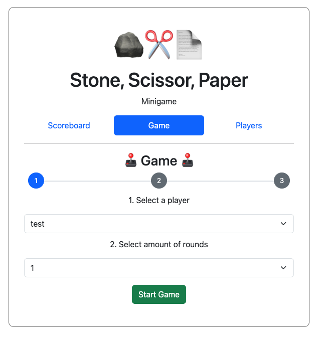

# Stone, Scissors, Paper Minigame

### TL;DR;

This mono repo which contains a mini gameEntity of Stone, Scissors, Paper
base on Java Spring Boot in the backend and
Angular frontend.

### Table of contents

1. [ Project Description ](#desc)
2. [ How to install ](#howtoinstall)
3. [ How to run ](#howtorun)
4. [ Open Todos ](#opentodos)

### Project Description

#### Entities

#### Project Communication Structure

This project also makes use of the following technologies:

- Java Spring Boot
- Maven
- Lombok
- H2 (Integration Tests)
- PostgreSQL
- GraphQL
- Angular
- Apollo-Angular
- Codegen-GraphQL
- Makefile
- Docker

### How to install
Prerequisites:

- Java 17 installed
- Maven installed
- Node Version 20 Installed
- Docker installed and engine running
- Make sure you are able to execute make command

Simply running the following command:

> make install

This will create the docker images for the frontend and backend on
your local machine

### How to run

To start the whole project please run the following command:

> make start

The frontend should now be accessible at [http://localhost:4200](http://localhost:4200)
and the backend at [http://localhost:8080](http://localhost:8080)

To try out GraphQL commands, head over to the GraphQL Playground at
[http://localhost:8080/graphiql](http://localhost:8080/graphiql).

### Open Todos

- [x] Create base folder structure
- [x] Backend: Create GraphQL Schema
- [x] Backend: Create Test Setup
- [x] Backend: Build Main Logic
- [x] Frontend: Add UI Framework
- [x] Frontend: Integrate GraphQL and Schema
- [x] Frontend: Build Game UI
- [x] Docker: Build Docker Compose setup
- [x] Make: Create Makefile Setup

### Potential refactoring and known bugs

- [ ] Frontend: seperate parts of the game.component.ts into seperate components
- [ ] Backend: improve integration tests to check more on values
- [ ] Overall: more comments for better understanding
- [ ] Frontend docker file: host static files instead of angular process
- [ ] Frontend scoreboard: implement nginit to always refresh list after game
